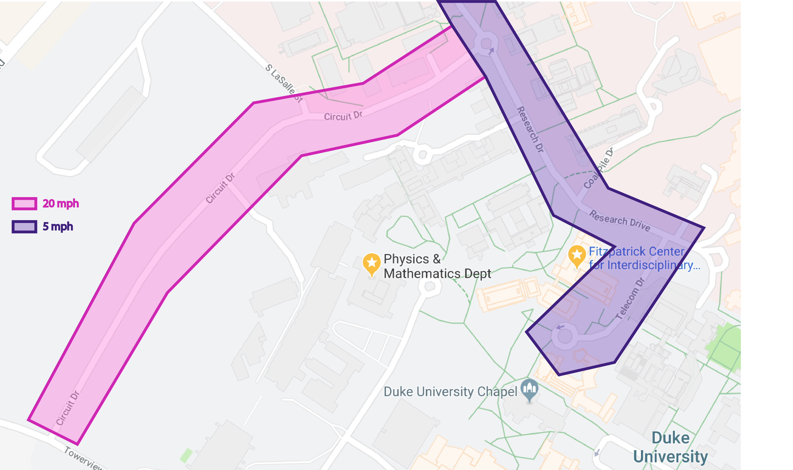

# Final Project - Physical Computing and the Internet of Things

*Name:*  Robert Steilberg

*NetID*: rhs16

*Date:* 12 December 2017

**_Note:_** GitHub's markdown doesn't always display image orientation correctly. Some images may be upside-down.

## Project: SpeedSpy / Particle Photon

SpeedSpy is aimed at correcting (or monitoring) one of the most common driver habits: excessive speeding. The project consists of a Particle Photon configured with an Adafruit Ultimate GPS Breakout and external antenna, a 4-ohm speaker, an external LED, and an Adafruit Mono 2.5W Class D Audio Amplifier. Together, along with a Blynk app integration, SpeedSpy monitors your vehicle's location and speed, pushes that information to the Blynk app, and emits a shrill alert via the speaker when the speed limit for the current road is exceeded.

A demo of SpeedSpy can be viewed [here](https://www.youtube.com/watch?v=IyeKg0UlMBg). The project repo can be viewed [here](https://github.com/robertsteilberg/SpeedSpy).


### Detailed Project Description

##### Description

The core of SpeedSpy lies in the Adafruit Ultimate GPS. The GPS unit interfaces with GPS satellites via the external antenna, providing the Photon with the approximate latitude, longitude, altitude, and speed of the device. The latitude and longitude provided by the GPS are used to determine the speed limit of the current road. If the current speed reported by the GPS exceeds this speed limit, a tone is emitted from the ohm speaker and the Blynk app is sent a notification. The tone's note denotes the degree to which the current speed limit is exceeded. Each increase in 5 miles per hour _over_ the speed limit results in the tone going up a note on the C-major scale.

The hardware components of SpeedSpy are fully integrated with the vehicle. The Photon, speaker, antenna, and external LED are designed to sit within the console of a vehicle. The Photon is powered via USB to the vehicle's stereo (a cigarette lighter DC socket would also work). Internet connectivity is achieved via tethering to a mobile phone. The external LED indicates whether or not the GPS has acquired enough satellites. A steady flashing LED indicates that the GPS is currently acquiring satellites while an occasional flash (every 10-20 seconds or so) indicates satellite acquisition (a "fix").

SpeedSpy also integrates with a Blynk app that visualizes detailed tracking and some control over the device. The SpeedSpy Blynk app includes a map widget for plotting locations where readings were taken along with the speed at the time of the reading. The below image depicts the interface of the Blynk app with a GPS coordinate selected, showing a speed of 43 miles per hour for that reading.


The SpeedSpy Blynk app also includes a mute button for silencing the speeding alarm, a speedometer for visualizing the current GPS speed, and two indicators that respectively signal speeding and a GPS fix (or lack thereof).

##### Discussion

SpeedSpy was originally named _SpeedSpotter_ in hopes that it would become a device for monitoring one's speed and evaluating driving habits over time. However, as the development process progressed, it became increasingly obvious that this was more of a tool for monitoring by an external party or perhaps forced compliance. In a way, the project has evolved into a criticism of excess "Big Brother"-esque espionage. Although one innocent application of this product could be for parents who want to teach, enforce, or watch for bad driving habits on behalf of their children, such a device could easily snowball into a justification for monitoring the speed of any driver at the hand of a government or other enforcement agency. Law enforcements agencies, for example, could apply SpeedSpy to make it easier to punish speeding drivers, ideally enforcing better driving habits yet simultaneously violating the privacy of a driver who has earned the right to drive unmolested. Many insurance companies are already applying this principle--drivers who agree to drive with speed-monitoring devices like SpeedSpy are promised lesser rates in exchange for speeding less. However, this often results in higher rates since few drivers actually strictly conform to the posted speed limit at all times.

In lieu of these applications, I propose a more appropriate one. I envision my device as a tool for rehabilitation--specifically, for repeat traffic offenders. For example, a convicted speeder could be allowed an opportunity to lessen the "points" levied against their driving record in exchange for allowing SpeedSpy to track their speed and demonstrate that they have broken their speeding habit. Perhaps the firmware could be changed such that locational info never leaves the device and is not pushed to Blynk. In this case, the offender has nothing to lose, a sharp distinction from the concept of insurance companies monitoring their policyholders' speed. Furthermore, I provide a method for allowing reasonable driving habits: a speed buffer. The `speedBuffer` global variable allows a driver to go over the speed limit by a determined number of miles per hour without triggering the alarm, thus allowing a SpeedSpy subject to speed within reasonable limits. This, in my opinion, reflects a much more reasonable scenario than expecting a driver to always conform to the posted speed limit, which is unrealistic.

SpeedSpy is responding to a frequent and common problem--speeding. Most drivers speed habitually, and speeding has the potential to cause life-threatening accidents. Ideally, SpeedSpy would be used in a manner for reducing this risk, but there is nevertheless a fine line that is easily crossed in terms of violating one's right to privacy. For example, a driver could be in a vehicle with SpeedSpy installed and not even know it. As shown later in this document, all of SpeedSpy's components are completely hidden from view within the vehicle's console except for the Fix LED. A parent, enforcement agency, or other party need only install SpeedSpy without the Fix LED to covertly monitor and record information about a driver without their knowledge. There could be a law or philosophical argument here regarding the applicability of the Fourth Amendment of the Constitution to SpeedSpy, but this notion is beyond the scope of this README. In conclusion, IoT devices like SpeedSpy fuel the already heated debate surrounding covert data collection.


### Technical Description

##### Development process

I began by configuring the GPS to print basic locational information to the serial console. This is achieved through interrupts that make a call to the GPS every two seconds. After I was able to successfully retrieve and store data from the GPS on the Photon, I geofenced several streets by plotting the series of latitude and longitude points that constructed a polygon covering the specific street. A custom `street` type definition was created to store these points. The `street` typdef, which can be viewed [here](code/street.h), stores the latitude and longitude points of the geofenced polygon, the street's name, and its speed limit. I then found an algorithm (sourced from [this webpage](http://alienryderflex.com/polygon/)) for determining whether the current location is within a complex geofence. Ultimately, I assimilated all of this data and used it to compute where the vehicle was located, its speed, and if it was exceeding the speed limit, thus forming the core functionality of SpeedSpy.

Once I had fully developed the basic functionality, I installed an amplifier and speaker for sounding the tone alert when it was determined that the vehicle was speeding. I then wrote logic for sounding a certain note on the C-major scale depending on the degree to which the vehicle was speeding.

I then focused on installation--specifically, what would be necessary for the device to function correctly in the vehicle. I first installed the SMA to uFL adapter and GPS external antenna to provide a consistent satellite fix in the vehicle. The Adafruit GPS automatically determines if the external antenna is connected and switches to its band. Lastly, I connected a simple LED to the GPS board and routed this out of the console (shown in detail below in the design section) so that the driver could easily see whether or not the GPS had a satellite fix. I placed the Photon/breadboard, speaker, and antenna within the console of the vehicle near the flood boards. I attached the antenna magnetically to the radio and connected the Photon to my stereo system via a USB cable normally used for charging and playing my iPod. After preliminary testing, I buttoned everything up, leaving the vehicle looking exactly as it had before save for the Fix LED.

Lastly, I developed and connected the Blynk app for monitoring the location and speed of the vehicle, displaying the status of the GPS fix, and providing the ability to mute the speeding alarm.

#### Hardware Wiring Diagram

The Fritzing wiring diagram is shown below. The exact GPS antenna used in the SpeedSpy prototype has no official Fritzing schematic, so an approximate replacement is shown.

Interestingly, to exchange data, the GPS need only have its `TX` pin connected to the Photon's `RX` pin along with basic power. The Fix LED requires no code, as it will simply mirror the onboard GPS fix light through the `FIX` pin. The antenna connects to the onboard GPS uFL port.

The amplifier requires two ground connections, one for the speaker and one for the amplifier (enables volume potentiometer). The speaker tone is driven through the connection between the Photon's `D2` pin and the amplifier's `A+` pin. The speaker is then connected to the amplifier.


##### Hardware

The [Particle Photon](https://store.particle.io/products/photon) runs SpeedSpy's firmware, connects to the internet and interfaces with [Blynk](http://www.blynk.cc/), and handles reading from the GPS and driving the speaker. The Photon is powered by the vehicle's stereo via USB. WiFi connectivity and Blynk functionality is provided via a tethered cell phone.

The [Adafruit Ultimate GPS](https://www.adafruit.com/product/746) is a GPS board that is powered by the Photon and delivers data containing location and speed. Its ability to acquire a satellite fix is enhanced through connection to an [external antenna](https://www.adafruit.com/product/960) via a [SMA to uFL adapter](https://www.adafruit.com/product/851).

The [4-ohm speaker](https://www.adafruit.com/product/1314) is driven by an [amplifier](https://www.adafruit.com/product/2130) that allows for volume control via an onboard trim potentiometer.

Lastly, an external LED is connected to the `FIX` pin of the GPS board to allow easy visualization of satellite connectivity from the console of the vehicle. Without this LED, it would be impossible to know if the GPS had acquired a fix without opening up the console of the vehicle and inspecting the GPS board.

Shown below are the connected hardware components of SpeedSpy outside of the vehicle's console enclosure.


The main breadboard with the Photon, amplifier, and GPS unit installed is show below.


##### Software

The following is a _very_ high-level discussion of SpeedSpy's firmware. A more technical description and link to source code is included under the `Code` section.

The `Adafruit_GPS` library provides basic utilities for reading data from the Adafruit Ultimate GPS Breakout Board. The `Blynk` library allows for sending data and receiving commands from the SpeedSpy Blynk app.

In the `setup()` function, the GPS is initialized, the street geofences are defined, the speaker is enabled, and the Blynk processes are initiated.

In each iteration of the `loop()` function, data is first read from the GPS. If the GPS has a satellite fix, the Fix LED is turned on, and each defined geofence is queried to determine if the vehicle is located within that geofence. If so, a speed limit for that iteration is defined; otherwise, a speed limit will not be defined, and no check will be made to determine if the vehicle is speeding, since the local speed limit is not known.

If the vehicle is located within a geofence for a particular street, and the GPS indicates that the current speed exceeds that street's speed limit, the alarm is sounded via `alarm()`, a custom `tone()` call that issues commands to the amplifier. Relevant data is then pushed to Blynk.


#### Code

The firmware source code can be found [here](code/SpeedSpy.ino). The custom `street` type definition can be found [here](code/street.h).

##### Global variables

`GPSECHO` is a boolean definition for printing raw GPS data to the serial console and is useful for determining if the GPS is functioning properly. `debug` is a boolean definition for printing parsed (readable) GPS data to the serial console. `timer` is the variable used for determining if two seconds have elapsed, triggering a reading from the GPS board.

`blynkMap`, `blynkFixLED`, and `blynkSpeedLED` respectively represent the Blynk map widget, satellite fix LED Blynk indicator, and speeding LED Blynk indicator. These constants are used to push data to the SpeedSpy Blynk app.

`mapIndex` describes how many total readings have been taken and is used to differentiate latitude/longitude coordinates sent to the Blynk map widget so that they show up on the map as separate location pointers with unique speed values. `muted` is set and used to determine whether or not to mute the speeding alarms.

The various `street` definitions represent each of the geocached streets. The `typedef` for a `street` is shown below and defines the points that make up the street's geofence, its speed limit, and its name.

```
// defines a street type definition
typedef struct {
  String name;
  // support up to 10 points, since float is 4 bytes
  float polyX[40];
  float polyY[40];
  int numPoints;
  int speedLimit;
} street;
```

The latitude/longitude pairs that define the street's geofence are stored as an array of `X` and `Y` values (`polyX` and `polyY`).

##### Setup

`initGPS()` performs several chores necessary to prepare the GPS unit for sending data. It starts the serial output, sets a 1 Hz refresh rate, and sends a series of commands that activate the GPS. It also initializes the interrupt used for reading from the GPS. `handleSysTick()`, `useInterrupt()`, and `readRawGPS()` are Adafruit-provided functions used to properly control and read from the GPS unit.

`defineStreets()` sets the geofences around each street and caches them. The manner in which streets are geofenced is visually represented below with Circuit Drive and Research Drive.



Each street is individually geofenced as shown in the diagram by setting a series of X and Y coordinate points that represent the latitude/longitude pairs that compose the polygon that geofences each street. A name and speed limit is set for each street, and all geofenced streets are then stored in a `street` array, `streets`.

The speaker is then initialized and the Blynk instance is authorized for sending and receiving data.

##### Loop

Described here are the actions taken during each iteration of the `loop()` call.

First, the GPS is checked to see if it has successfully read usable data via `badGPSRead()`. If the GPS unit has downloadable data and the two-second timer has elapsed, the timer is reset and the GPS is checked for a fix. Importantly, if the GPS does not have a satellite, the following occurs:

```
if (!GPS.fix) {
  fixLed.off();
  noTone(speakerPin);
  return;
}
```

If the GPS doesn't have a fix, a `noTone()` command must be issued so that the speaker does not sound at an incorrect time (i.e. the driver was speeding, lost a fix, and then stopped speeding). The `loop()` then returns since there is no work that can be done if there is no fix.

If a fix is found, the Blynk fix LED indicator is turned on via `fixLed.on()`. A current latitude/longitude pair is read from the GPS, the Blynk app is updated with the current location and speed, and then each street is checked to see if the latitude/longitude pair is contained within its geofence.

This check is done through an algorithm defined by `pointOnStreet()`, a boolean function that returns true if the given `x,y` pair (representing latitude/longitude) is contained within the given street `s`. This is achieved by checking if the given latitude/longitude point downloaded from the GPS is contained within the polygon defined by the points in the given `street`. The algorithm is sourced from and described in detail [here](http://alienryderflex.com/polygon/).

```
for (int i = 0; i < (sizeof(streets)/sizeof(street)); i++) {
  if (pointOnStreet(GPS.longitudeDegrees, GPS.latitudeDegrees, streets[i])) {
    if (debug) Serial.println(streets[i].name);
    speedLimit = streets[i].speedLimit;
  }
}
```

As shown above, if the given latitude/longitude pair is indeed located on the street, the `speedLimit` variable is updated with the current speed limit.

If no street is found containing the current latitude/longitude pair, no speed limit will be defined, so the speaker is silenced and `loop()` returns, similar to when there is no satellite fix.

One potential bug introduced by this algorithm (that should be resolved in a production release of this project) is the case where two geofences overlap. In this case, the `street` that both has the greatest index in the `streets` array and contains the current latitude/longitude point will have its speed limit chosen, which could potentially not reflect the actual street on which the vehicle is actually located.

Assuming there is a fix and a defined speed limit, the current speed from the GPS is compared against the speed limit. How large the difference is between the current speed and speed limit determines the frequency of the tone emitted from the speaker. Furthermore, `alarm()` will only sound the speaker if SpeedSpy has not been muted from the Blynk app.

```
void alarm(int frequency) {
  speedLed.on(); // alert Blynk that we are speeding
  if (muted) {
    noTone(speakerPin);
  } else {
    tone(speakerPin, frequency);
  }
}
```

`muted` is updated through a Blynk listener, defined by `BLYNK_CONNECTED` and `BLYNK_WRITE`.

There is also a value `speedBuffer` that defines how many miles per hour the driver can exceed the speed limit without triggering the alarm (i.e. a `speedBuffer` of 5 lets the driver speed by up to 5 miles per hour without setting an alarm). If the total adjusted difference (taking `speedBuffer` into account) does not exceed zero, no alarm is triggered.

After comparing the current speed to the speed limit and sounding the alarm if necessary, `loop()` returns and repeats.


### Design / Form

My goal in designing the hardware form for this project was minimal impact on the original aesthetic of my car. I wanted the entire device and all of its components to be hidden from view, entirely contained within the innards of my car. I needed to go as small as possible, and to achieve this, I decided to use a Particle Photon that I had acquired during a Co-Lab course on IoT. I set the Photon, amplifier, and GPS board all within the constraints of a single mini breadboard, with the only external connections being the speaker, GPS antenna, and fix LED. The USB power cable is routed within the console into the back of the stereo. The only visible component is the fix LED, which pokes out of the console, as highlighted below.


As shown above, when the console is put back together, the car looks completely normal. Yet, SpeedSpy will automatically engage once the stereo is powered, provided there is an enabled hotspot in the vicinity.

I also value an intuitive user interface experience. I wanted any user to be able to easily view data provided by SpeedSpy and provide some control as well. My goal in designing the Blynk app was to make the user interface as clean and intuitive as possible while simultaneously providing the most useful information. As shown below, the Blynk app cleanly displays location and speed information, allows simple muting of the alarm, and even provides some debugging capabilities in terms of the Fix and Speeding indicator LED widgets.


I always emphasize function over form when I design a technological product. I wanted SpeedSpy to be a seamless integration with my vehicle, which is what this setup achieves. In this way, the unique aesthetic of the IoT device is lost, but the original aesthetic of my car is preserved, which has always been my goal for the custom improvements that I have made to my car (installing an iPod integration, painting window sidings, switching out interior lights for LEDs, et cetera). Regardless, the unique functionality of the IoT device is preserved.

The rest of the components are nestled between the carpeting and inner console, as shown below.


The placement of the external antenna is shown below.


### Evaluation / Reflection

On the whole, I am extremely pleased with the culmination of this project. When I was considering this project around the time of the midterm, I was not confident that an IoT GPS board would be accurate enough to provide locational data that could determine the current street and speed with enough precision to accurately test against a speed limit. I was pleasantly surprised to find that the Adafruit Ultimate GPS is a perfect plug-and-play device that is easy to set up and extremely accurate.

One component I struggled with was finding a method for determining the speed limit of the current street. I was disappointed that the Google Maps API does not provide speed limit support without a business-level pricing plan. In retrospect, I should have spent more time investigating potential APIs for determining the speed limit, or allowed myself enough time to push Google for some kind of educational license so that I could use their premium API features. However, I am nevertheless pleased with my choice to substitute API calls with geofencing.

I'm also particularly happy with how the hardware setup turned out. Not only is my hardware very neatly laid out on the breadboard with permanent wiring, but it also integrates seamlessly with my vehicle, and gives the impression that it is a factory component of the vehicle.

This project taught me how powerful IoT is in terms of dealing with complex data such as location. The Adafruit GPS unit was extremely powerful, and the Blynk platform allowed me to visualize that data in a way that made it accessible and easy-to-use. All in all, I've discovered that IoT has some very useful applications to data science and furthermore arouses an important discussion of proper data usage, privacy rights, and responsible use cases for the uniquely specific data that these devices can collect.
